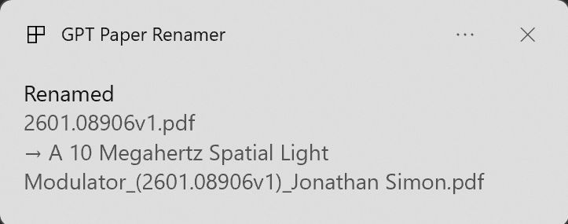

# GPT Paper Renamer

Watches a folder and renames new academic PDFs based on the title/author that an OpenAI model extracts from the first page. Cross-platform tray app (Windows + macOS).



## Install & run

Requires Python 3.10+ on your `PATH` to create a virtual environment.

| OS | Step |
|---|---|
| **Windows** | Double-click `run_app.bat` |
| **macOS** | `chmod +x run_app.command` once, then double-click it |

On first launch the script creates a local `.venv/`, installs dependencies, runs a short CLI wizard (API key · watch folder · filename format · ask-before-rename), and starts the tray icon.

## Tray menu

| Item | Effect |
|---|---|
| Watching: *folder* | info only |
| **Pause / Resume** | stop/start reacting to new files |
| **Ask before rename** | toggle Rename/Cancel prompt before each rename (persisted to `config.yaml`) |
| **Start at login** | toggle autostart (Windows registry / macOS LaunchAgent) |
| Open watch folder | reveal in Explorer/Finder |
| View log | open `app.log` |
| **Settings...** | open the CLI wizard in a new terminal (change key, folder, format, re-install .venv) |
| Quit | clean shutdown |

Green icon = active · grey = paused.

## Config

All settings live in [config.yaml](config.yaml) (written by the wizard, re-written by tray toggles — both preserve the documented format). Every field has an inline explanation. Common ones:

- `watch_folder` — `"~/Downloads"` by default
- `model` — `gpt-5-mini`, `gpt-4.1-mini`, `gpt-4o`…
- `api_key` — or set `OPENAI_API_KEY` in your env (env wins)
- `filename_format` — `{title}` `{author}` `{original}` tokens
- `require_confirmation` — toggle per rename

## Re-initialize

| Need | Do |
|---|---|
| Change one answer | tray → **Settings...**, pick an option in the menu |
| Force a fresh config | delete `config.yaml`, relaunch |
| Re-install dependencies | tray → **Settings...** → **Re-install .venv**, then quit & relaunch |
| Full clean install | delete `.venv/` and `config.yaml`, relaunch |

The wizard shows current values and asks **y/N** before editing each setting, so it's safe to browse without changing anything.

## Headless

```bash
python app.py --headless
```

No tray; Ctrl-C to stop.

## Layout

```
app.py              # entry point (runs tray on main thread)
src/
  config.py         # pydantic config + documented-YAML writer
  wizard.py         # first-run CLI wizard
  extractor.py      # OpenAI structured-output client
  handler.py        # watchdog + background worker
  tray.py           # pystray icon + menu
  confirm.py        # Rename/Cancel dialog (toast + Tk fallback)
  files.py          # PDF helpers + filename sanitizer + rename
  system.py         # app identity + autostart (Windows reg / macOS LaunchAgent)
config.yaml         # your config (git-ignored, fully documented)
run_app.bat         # Windows launcher (bootstraps .venv + wizard)
run_app.command     # macOS launcher
```

## Troubleshooting

- **Tray doesn't appear after first setup** → check `app.log` in the project folder; a Tk error dialog should also pop up with the traceback.
- **`.venv` creation fails with "path not found"** → your `python` is MSYS2 or the Windows Store stub. Install real Python from [python.org](https://www.python.org/downloads/) and tick *Add to PATH*. The launcher auto-detects Anaconda/Miniconda if present.
- **macOS menu bar icon missing** → focus Terminal once, or bundle with `pyinstaller --windowed app.py`.
